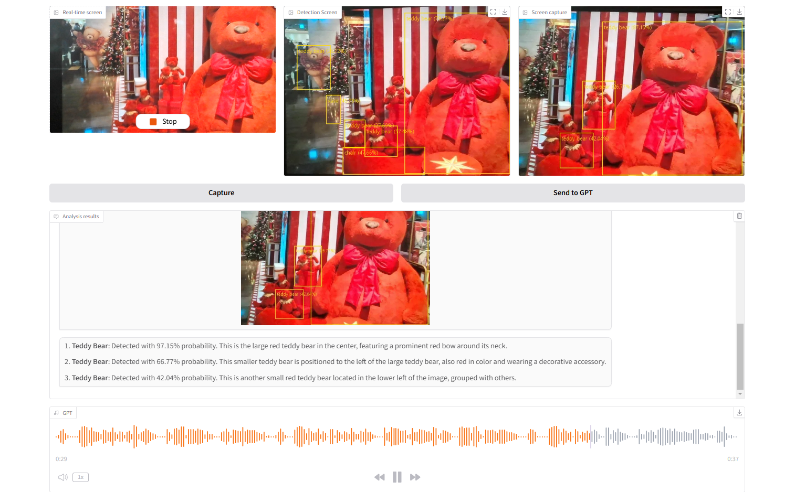
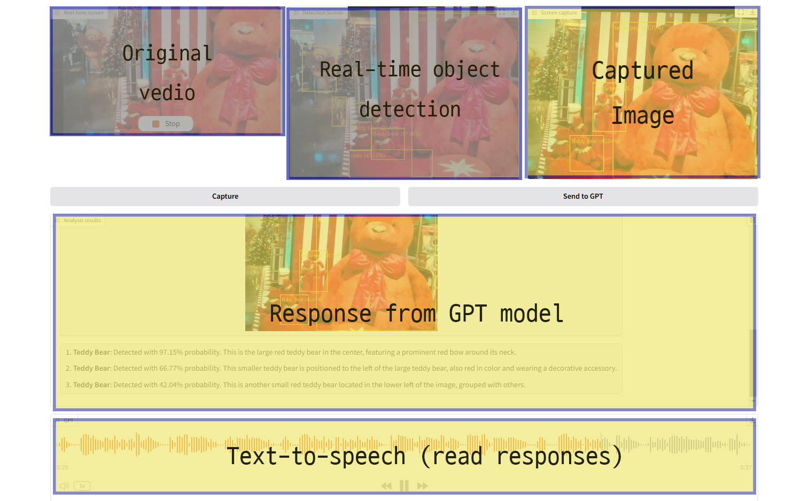

# Vision Detection Project

This project uses the YOLOv8 model for real-time object detection and integrates it with Microsoft Azure services. The system also provides descriptive analysis of detected objects using OpenAI GPT and generates audio output via Azure Text-to-Speech (TTS).

---

## Features

- **Real-Time Object Detection**: Uses the YOLOv8 model to detect objects in real-time from webcam input.
- **Descriptive Analysis**: Sends detected object data to OpenAI's GPT model for detailed textual analysis.
- **Audio Output**: Converts GPT-generated descriptions to audio using Azure TTS.

---


## Usage

### Run the Project
1. Start the application:
```
    python main.py
```

2. Open the Gradio interface in your default browser. Interact with the application via:
- Webcam Input: Start the webcam stream for object detection.
- Capture Button: Capture the current frame for analysis.
- Send to GPT: Generate descriptive analysis of detected objects.
- Audio Output: Listen to the audio description of the detected objects.


## Project Structure
```
    vision-detection-project/
│
├── main.py                   # Main entry point for the application
├── yolo_model.py             # YOLO model loading and object detection logic
├── openai_service.py         # Communication with OpenAI's GPT for analysis
├── speech_service.py         # Communication with Azure TTS for audio generation
├── gradio_ui.py              # Gradio interface and event listeners
├── config.py                 # Environment variable loader
├── requirements.txt          # Python dependencies
├── README.md                 # Project documentation
└── .env                      # Environment variables (not included in the repo)
```

## Key Dependencies
- Ultralytics YOLO: For object detection.
- Gradio: For building the interactive UI.
- Microsoft Azure OpenAI: For descriptive text generation.
- Microsoft Azure TTS: For converting text to speech.
